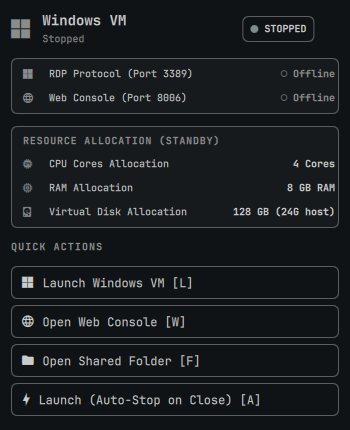
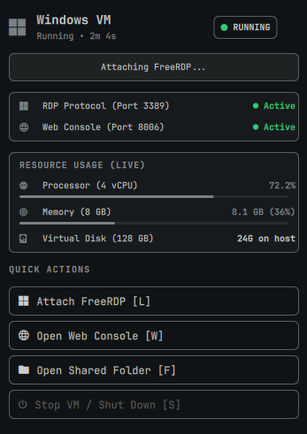

# Omarchy Windows VM Widget

A native Quickshell status bar widget and popover control panel for managing, launching, and monitoring the containerized Windows VM on **Omarchy Quattro** (`omarchy-shell`).

---



## Features

- 󰍲 **Real-Time Bar Indicator**: Displays current VM state directly on your top bar:
  - **Stopped**: Clean muted Windows icon and status.
  - **Booting / Starting**: Pulsing accent indicator with `"BOOT…"` state.
  - **Running**: Vibrant accent icon with active status dot and RDP session indicator (`"WIN (RDP)"`).
  - **Stopping**: Amber warning indicator with graceful shutdown feedback.
- ⚡ **Zero-Privilege Probing**: Uses lightweight local socket and port querying (`ss -Htln`) to detect VM state without recurring polkit password prompts.
- ️ **Instant Launch Modes**:
  - **FreeRDP Standard**: Launches fullscreen RDP session and automatically stops the VM container when the session window is closed.
  - **FreeRDP Keep-Alive (`-k`)**: Leaves the VM running in the background when RDP disconnects.
  - **Web Console**: Direct 1-click access to the browser console (`http://127.0.0.1:8006`).
- 📁 **Shared Folder Shortcut**: Quick access to open the host shared directory (`~/Windows`) in your default file manager.
- ⌨️ **Keyboard Friendly**: Fast navigation with single-key shortcuts when the panel is focused (`L`, `K`, `W`, `F`, `S`, `R`, `Esc`).

---

## Installation

### Via Omarchy CLI (Remote Git Repository)
```bash
omarchy plugin add https://github.com/yanuarpmbd/omarchy-winvm-widget.git --enable
omarchy bar move io.github.yanuarpmbd.winvm --section right
```

### Local Development (Live Sync)
If you are developing or testing changes locally:
```bash
./dev/sync
```
This script validates all manifests with `omarchy plugin validate`, checks QML with `qmllint`, syncs files to `~/.config/omarchy/plugins/io.github.yanuarpmbd.winvm/`, and reloads the Omarchy shell.

---

## Uninstallation

To remove the plugin from Omarchy:
```bash
omarchy plugin remove io.github.yanuarpmbd.winvm
```

---

## Panel Keyboard Shortcuts

When the Windows VM panel popover is open, you can use the following keys:

| Key | Action |
|---|---|
| <kbd>L</kbd> | Launch FreeRDP (auto-stop on window close) |
| <kbd>K</kbd> | FreeRDP Keep-Alive (keeps VM running) |
| <kbd>W</kbd> | Open Web Console in default browser |
| <kbd>F</kbd> | Open Shared Folder (`~/Windows`) |
| <kbd>S</kbd> | Stop / Gracefully shut down VM container |
| <kbd>R</kbd> | Force status & port refresh |
| <kbd>Esc</kbd> | Close panel popover |

---

## Configuration

Settings can be customized in your Omarchy shell configuration or via the plugin settings:

| Setting | Type | Default | Description |
|---|---|---|---|
| `autoHide` | boolean | `false` | Hide widget from the bar when VM is stopped |
| `pollInterval` | number | `4` | Status check interval in seconds |
| `defaultLaunchMode` | string | `"rdp-keepalive"` | Default mode (`"rdp-keepalive"`, `"rdp"`, or `"web"`) |
| `sharedFolderPath` | string | `"~/Windows"` | Host folder path mounted into Windows VM |

---

## Optional: Hyprland Window Rules

To optimize your FreeRDP experience with Hyprland on Omarchy, you can add window rules to `~/.config/hypr/hyprland.conf`:

```ini
windowrulev2 = workspace 9, class:^(xfreerdp)$, title:^(Windows VM - Omarchy)$
windowrulev2 = fullscreen, class:^(xfreerdp)$, title:^(Windows VM - Omarchy)$
```

---

## License

MIT License
